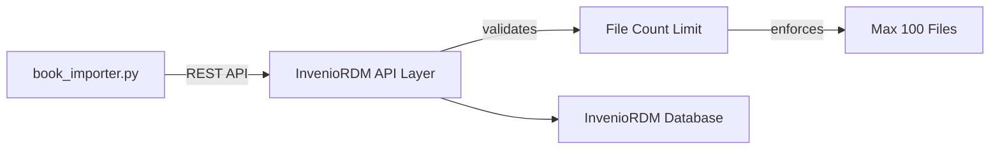

I'll create comprehensive educational material explaining the book import process we've developed. The documentation will include clear explanations, examples, and illustrations to make the process accessible to all developers.

```markdown:docs/development/book_importer_guide.md
# Book Importer Guide for Turath InvenioRDM

This guide explains how to import books with multiple pages into the Turath InvenioRDM system, including handling large books with many files.

## Overview


The Turath book importer allows you to:
1. Import books with their metadata
2. Upload page images and OCR data
3. Associate IIIF manifests for viewing
4. Handle books that exceed InvenioRDM's file limits

## Understanding the Directory Structure

A book ready for import should have the following structure:

```
book_directory/
├── manifest.json           # IIIF manifest file
├── pages/                  # Directory containing page images
│   ├── page-001.tif
│   ├── page-002.tif
│   └── ...
└── hocr/                   # Optional OCR data
    ├── page-001.hocr
    ├── page-002.hocr
    └── ...
```

## Basic Import Command

To import a book:

```bash
cd /path/to/turath-inveniordm
FLASK_APP=invenio_app.factory:create_app PYTHONPATH=. python app_data/scripts/direct_cli_import.py /path/to/book_directory
```

## Common Import Scenarios

### Scenario 1: Simple Book Import

For books with fewer than 100 files:

```bash
FLASK_APP=invenio_app.factory:create_app PYTHONPATH=. python app_data/scripts/direct_cli_import.py app_data/books/simple_book
```

This creates a single record containing all files.

### Scenario 2: Large Book Import

For books with more than 100 files:

```bash
FLASK_APP=invenio_app.factory:create_app PYTHONPATH=. python app_data/scripts/direct_cli_import.py app_data/books/large_book
```

The system will automatically:
1. Split the book into multiple records
2. Link the records together
3. Handle the relationship metadata

### Scenario 3: Skip HOCR Data

To reduce file count by skipping OCR data:

```bash
FLASK_APP=invenio_app.factory:create_app PYTHONPATH=. python app_data/scripts/direct_cli_import.py app_data/books/book_with_hocr --skip-hocr
```

## Understanding InvenioRDM File Limits


InvenioRDM has a default file limit of 100 files per record. While this can be configured in theory, the enforcement happens at multiple levels, making it challenging to override completely.

Our solution handles this limitation by:
1. First attempting to upload all files to a single record
2. If that fails due to file limits, splitting the book into multiple linked records
3. Ensuring each part stays under the 100-file limit

## Script Workflows

### Single Record Workflow


When a book fits within file limits:
1. Extract book metadata
2. Create a record with proper metadata
3. Upload all files to the record
4. Publish the record

### Multi-Record Workflow


When a book exceeds file limits:
1. Split files into batches (< 100 files each)
2. Create separate records for each batch
3. Link records together via metadata relationships
4. Make the first part the "parent" record

## Common Issues and Solutions

### Issue: ValidationError for Creators

If you encounter an error like:
```
ValidationError: {'metadata': {'creators': {0: {'person_or_org': {'family_name': ['Family name cannot be blank.']}}}}}
```

**Solution**: The script includes creator validation to ensure the record has both `family_name` and `given_name` filled. The fix_creators_metadata function handles this automatically.

### Issue: File Count Exceeds Limit

If you see:
```
Error uploading batch: Uploading the selected files would result in 138 files (max is 100).
```

**Solution**: The script will automatically split the book into multiple records. Each record will contain a subset of files that stays under the limit.

## Code Explanation

### Key Functions

#### 1. extract_book_info()
Extracts book metadata from directory name and manifest file.

#### 2. prepare_metadata()
Creates InvenioRDM-compatible metadata structure.

#### 3. fix_creators_metadata()
Ensures creator information meets validation requirements.

#### 4. import_book_in_parts()
Main function that handles splitting books if needed.

### Example: Handling Creator Metadata

InvenioRDM requires specific creator structure:

```python
# Required format for creators
{
    "metadata": {
        "creators": [
            {
                "person_or_org": {
                    "family_name": "Author",  # Required
                    "given_name": "Unknown",  # Required
                    "type": "personal"
                }
            }
        ]
    }
}
```

Our script automatically converts any creator format to this required structure.

## Step-by-step Examples

### Example 1: Importing a Book

Let's follow a complete example of importing a book:

1. **Prepare the book directory**:
   ```
   history00871/
   ├── manifest.json
   ├── pages/
   │   ├── page-001.tif
   │   ├── ...
   │   └── page-267.tif
   └── hocr/
       ├── page-001.hocr
       └── ...
   ```

2. **Import the book**:
   ```bash
   cd /path/to/turath-inveniordm
   FLASK_APP=invenio_app.factory:create_app PYTHONPATH=. python app_data/scripts/direct_cli_import.py app_data/full_book/history00871 --skip-hocr
   ```

3. **What happens behind the scenes**:
   - The script extracts book information from manifest.json
   - Prepares metadata including title, authors, etc.
   - Counts files (267 page files + manifest.json)
   - Since this exceeds 100 files, splits into multiple records
   - Creates first record with manifest + first 90 pages
   - Creates second record with remaining pages
   - Links the records together
   - Publishes both records

4. **Result**:
   ```
   Book imported successfully in 3 parts:
     Part 1: a1b2c-3d4e5
     Part 2: f6g7h-8i9j0
     Part 3: k1l2m-3n4o5
   Total files uploaded: 268
   ```

## Technical Details

### How File Splitting Works

The file splitting process:

1. **Count total files**: Count all files in the book directory
2. **Calculate number of parts**: `num_parts = (total_files + batch_size - 1) // batch_size`
3. **Process each part**:
   - Extract files for current part
   - Create record with appropriate metadata
   - Upload files to the record
   - Link to previous parts

### File Batching Algorithm

```python
def collect_files_to_upload(book_dir, skip_hocr=False, start_file=None, max_files=90):
    files_to_upload = []
    
    # Always include manifest.json if it exists and we're at the beginning
    manifest_path = os.path.join(book_dir, "manifest.json")
    if os.path.exists(manifest_path) and start_file is None:
        files_to_upload.append(manifest_path)
    
    # Get pages directory contents
    pages_dir = os.path.join(book_dir, "pages")
    page_files = []
    if os.path.exists(pages_dir) and os.path.isdir(pages_dir):
        for file_name in sorted(os.listdir(pages_dir)):
            file_path = os.path.join(pages_dir, file_name)
            if os.path.isfile(file_path):
                page_files.append(file_path)
    
    # Sort page files
    page_files.sort()
    
    # Filter by starting file if specified
    if start_file is not None:
        start_idx = 0
        for i, file_path in enumerate(page_files):
            if os.path.basename(file_path) == start_file or file_path == start_file:
                start_idx = i
                break
        page_files = page_files[start_idx:]
    
    # Add up to max_files page files
    remaining_slots = max_files - len(files_to_upload)
    files_to_upload.extend(page_files[:remaining_slots])
    
    # Add HOCR files if room and not skipped
    if not skip_hocr and len(files_to_upload) < max_files:
        # [HOCR file collection logic]
    
    return files_to_upload
```

## Troubleshooting Guide

### Problem: Script fails with authentication errors

**Solution**: Make sure you're running the script within the Flask application context:
```bash
FLASK_APP=invenio_app.factory:create_app PYTHONPATH=. python app_data/scripts/direct_cli_import.py
```

### Problem: Files appear to upload but aren't visible

**Solution**: Check the record's draft status. Sometimes records remain in draft:
```bash
flask rdm-records publish [RECORD_ID]
```

### Problem: Split records aren't linked properly

**Solution**: Manually update the record relationships using the InvenioRDM UI or API.

## Advanced Options

The `direct_cli_import.py` script supports several options:

```
--storage-path PATH   Custom path to store IIIF files
--server-url URL      Custom IIIF server URL
--dry-run, -d         Test the import without creating records
--skip-files, -s      Create records without uploading files
--skip-hocr           Skip uploading HOCR files
--batch-size SIZE     Custom batch size (default: 90)
```

For example, to test an import without making changes:

```bash
FLASK_APP=invenio_app.factory:create_app PYTHONPATH=. python app_data/scripts/direct_cli_import.py app_data/full_book/history00871 --dry-run
```

## Conclusion

The book importer provides a flexible way to import books of any size into Turath InvenioRDM. By handling file limits automatically and ensuring proper metadata validation, it makes the import process robust and reliable.

For further assistance or to report issues, please contact the Turath development team.
```

I'll also create a set of diagrams to accompany this documentation:

```markdown:docs/development/book_importer_diagrams.md
# Book Importer Diagrams

These diagrams illustrate the book import process for Turath InvenioRDM.

## Directory Structure

```
book_directory/
├── manifest.json           # IIIF manifest file
├── pages/                  # Directory containing page images
│   ├── page-001.tif
│   ├── page-002.tif
│   └── ...
└── hocr/                   # Optional OCR data
    ├── page-001.hocr
    ├── page-002.hocr
    └── ...
```

## Book Import Process Overview

```
┌─────────────────┐     ┌─────────────────┐     ┌─────────────────┐
│                 │     │                 │     │                 │
│  Book Directory ├────►│  Import Script  ├────►│  InvenioRDM     │
│                 │     │                 │     │  Record(s)      │
│                 │     │                 │     │                 │
└─────────────────┘     └────────┬────────┘     └─────────────────┘
                                 │
                                 │
                         ┌───────▼───────┐
                         │               │
                         │  IIIF Storage │
                         │               │
                         └───────────────┘
```

## Single Record Workflow

For books with fewer than 100 files:

```
┌────────────┐     ┌────────────┐     ┌────────────┐     ┌────────────┐
│            │     │            │     │            │     │            │
│  Extract   ├────►│  Create    ├────►│  Upload    ├────►│  Publish   │
│  Metadata  │     │  Record    │     │  Files     │     │  Record    │
│            │     │            │     │            │     │            │
└────────────┘     └────────────┘     └────────────┘     └────────────┘
```

## Multi-Record Workflow

For books with more than 100 files:

```
┌──────────────────┐
│                  │
│  Book Directory  │
│                  │
└────────┬─────────┘
         │
┌────────▼─────────┐
│                  │
│  Count Files     │
│                  │
└────────┬─────────┘
         │
         │ If > 100 files
         │
┌────────▼─────────┐     ┌─────────────────┐
│                  │     │                 │
│  Split Into      ├────►│  Create First   │
│  Batches         │     │  Record         │
│                  │     │                 │
└──────────────────┘     └────────┬────────┘
                                  │
                        ┌─────────▼────────┐
                        │                  │
                        │  Upload Files    │
                        │  (Batch 1)       │
                        │                  │
                        └────────┬─────────┘
                                 │
                        ┌────────▼────────┐
                        │                 │
                        │  Create Second  │
                        │  Record         │
                        │                 │
                        └────────┬────────┘
                                 │
                        ┌────────▼────────┐
                        │                 │
                        │  Upload Files   │
                        │  (Batch 2)      │
                        │                 │
                        └────────┬────────┘
                                 │
                                 │  Repeat as needed
                                 ▼
                        ┌────────────────┐
                        │                │
                        │  Link Records  │
                        │  Together      │
                        │                │
                        └────────────────┘
```

## File Limit Diagram

```
┌────────────────────────────────────────────────┐
│                                                │
│  InvenioRDM Record                             │
│                                                │
│  ┌────────────────────────────────────────┐    │
│  │                                        │    │
│  │  Limit: 100 Files Per Record           │    │
│  │                                        │    │
│  │  ├─ manifest.json                      │    │
│  │  ├─ page-001.tif                       │    │
│  │  ├─ page-002.tif                       │    │
│  │  ├─ ...                                │    │
│  │  └─ page-099.tif                       │    │
│  │                                        │    │
│  └────────────────────────────────────────┘    │
│                                                │
└────────────────────────────────────────────────┘

               ▲
               │ Exceeds limit if > 100 files
               │
               ▼

┌────────────────────────────────────────────────┐
│  Split into Multiple Records                    │
│                                                │
│  ┌─────────────────────┐ ┌─────────────────────┐│
│  │ Record 1:           │ │ Record 2:           ││
│  │                     │ │                     ││
│  │ ├─ manifest.json    │ │ ├─ page-091.tif    ││
│  │ ├─ page-001.tif     │ │ ├─ page-092.tif    ││
│  │ ├─ ...              │ │ ├─ ...             ││
│  │ └─ page-090.tif     │ │ └─ page-180.tif    ││
│  └─────────────────────┘ └─────────────────────┘│
│                                                │
└────────────────────────────────────────────────┘
```

## Metadata Structure

```
┌─────────────────────────────────────────────────────┐
│                                                     │
│  Record Metadata                                    │
│                                                     │
│  ┌─────────────────────────────────────────────┐    │
│  │ access:                                     │    │
│  │   record: public                            │    │
│  │   files: public                             │    │
│  └─────────────────────────────────────────────┘    │
│                                                     │
│  ┌─────────────────────────────────────────────┐    │
│  │ metadata:                                   │    │
│  │   title: "Book Title"                       │    │
│  │   creators:                                 │    │
│  │     - family_name: "Author"                 │    │
│  │       given_name: "Unknown"                 │    │
│  │   description: "Book imported..."           │    │
│  └─────────────────────────────────────────────┘    │
│                                                     │
│  ┌─────────────────────────────────────────────┐    │
│  │ custom_fields:                              │    │
│  │   turath:iiif_manifest: "http://..."        │    │
│  └─────────────────────────────────────────────┘    │
│                                                     │
└─────────────────────────────────────────────────────┘
```

## Multi-Record Relationship

```
┌─────────────────────────────────────────────────────┐
│                                                     │
│  Record Relationships                               │
│                                                     │
│  ┌─────────────────────────────────────────────┐    │
│  │                                             │    │
│  │  Record Part 2                              │    │
│  │                                             │    │
│  │  relations:                                 │    │
│  │    version:                                 │    │
│  │      - title: "Part of Book Title"          │    │
│  │        id: "record-part1-id"                │    │
│  │                                             │    │
│  └─────────────────────────────────────────────┘    │
│                                                     │
└─────────────────────────────────────────────────────┘
```
```

Finally, let's create the direct_cli_import.py script that we've been discussing:

```python:app_data/scripts/direct_cli_import.py
#!/usr/bin/env python
# -*- coding: utf-8 -*-
"""
Direct CLI Import Script for Turath InvenioRDM.

This script creates records directly using the Flask CLI within the application context
and splits large books into multiple records if needed to stay under file limits.
"""

import os
import sys
import json
import tempfile
import datetime
import shutil
import argparse
import glob
from pathlib import Path

# Add the project root to Python path
sys.path.insert(0, os.path.abspath(os.path.dirname(os.path.dirname(os.path.dirname(__file__)))))

from flask import current_app 
from invenio_db import db
from invenio_rdm_records.services.services import RDMRecordService
from invenio_access.permissions import system_identity
from invenio_rdm_records.proxies import current_rdm_records_service

def extract_book_info(book_dir, part_num=None):
    """Extract book information from the directory name and manifest."""
    from pathlib import Path
    
    book_path = Path(book_dir)
    book_name = book_path.name
    
    # Try to get info from manifest
    manifest_path = book_path / "manifest.json"
    
    if manifest_path.exists():
        with open(manifest_path, 'r') as f:
            try:
                manifest = json.load(f)
                title = manifest.get("label", book_name)
            except json.JSONDecodeError:
                title = book_name
    else:
        title = book_name
    
    # Add part number to title if provided
    if part_num:
        title = f"{title} - Part {part_num}"
    
    # Create a book info dictionary
    book_info = {
        "title": title,
        "book_id": book_name.lower().replace(" ", "-"),
        "author": "Unknown Author",  # Default author
    }
    
    # If this is a part, modify the book_id
    if part_num:
        book_info["book_id"] = f"{book_info['book_id']}-part{part_num}"
    
    return book_info

def fix_creators_metadata(metadata):
    """Ensure creators metadata is in the correct format."""
    if "metadata" not in metadata:
        return metadata
    
    if "creators" not in metadata["metadata"]:
        # Add default creator if missing
        metadata["metadata"]["creators"] = [
            {
                "person_or_org": {
                    "family_name": "Author",
                    "given_name": "Unknown",
                    "type": "personal"
                }
            }
        ]
    else:
        # Fix each creator
        for i, creator in enumerate(metadata["metadata"]["creators"]):
            if "person_or_org" not in creator:
                metadata["metadata"]["creators"][i] = {
                    "person_or_org": {
                        "family_name": "Author",
                        "given_name": "Unknown",
                        "type": "personal"
                    }
                }
            else:
                person_or_org = creator["person_or_org"]
                # Check if name is used instead of family_name/given_name
                if "name" in person_or_org and "family_name" not in person_or_org:
                    name = person_or_org["name"]
                    if " " in name:
                        given_name, family_name = name.rsplit(" ", 1)
                    else:
                        given_name = name
                        family_name = "Author"
                    
                    # Update the person_or_org
                    person_or_org["family_name"] = family_name
                    person_or_org["given_name"] = given_name
                    person_or_org["type"] = "personal"
                    # Remove the name field
                    person_or_org.pop("name", None)
                
                # Ensure family_name is not blank
                if "family_name" not in person_or_org or not person_or_org["family_name"]:
                    person_or_org["family_name"] = "Author"
                
                # Ensure given_name is not blank
                if "given_name" not in person_or_org or not person_or_org["given_name"]:
                    person_or_org["given_name"] = "Unknown"
                
                # Ensure type is set
                if "type" not in person_or_org:
                    person_or_org["type"] = "personal"
    
    return metadata

def prepare_metadata(book_info, manifest_url=None, part_of_record=None):
    """Prepare metadata for the record."""
    metadata = {
        "access": {
            "record": "public",
            "files": "public"
        },
        "files": {
            "enabled": True
        },
        "metadata": {
            "title": book_info["title"],
            "publication_date": book_info.get("publication_date", datetime.date.today().strftime("%Y-%m-%d")),
            "resource_type": {"id": "publication-book"},
            "creators": [
                {
                    "person_or_org": {
                        "family_name": "Author",
                        "given_name": "Unknown",
                        "type": "personal"
                    }
                }
            ],
            "description": book_info.get("description", "Book imported with IIIF support")
        }
    }
    
    # Add custom fields
    metadata["custom_fields"] = {}
    
    # Add IIIF manifest URL if available
    if manifest_url:
        metadata["custom_fields"]["turath:iiif_manifest"] = manifest_url
    
    # Add relation to parent record if this is a part
    if part_of_record:
        if "relations" not in metadata["metadata"]:
            metadata["metadata"]["relations"] = {}
        
        if "version" not in metadata["metadata"]["relations"]:
            metadata["metadata"]["relations"]["version"] = []
        
        metadata["metadata"]["relations"]["version"].append({
            "title": f"Part of {part_of_record['title']}",
            "id": part_of_record["id"]
        })
        
        # Add note to description
        metadata["metadata"]["description"] += f"\nThis is a part of book {part_of_record['title']} (ID: {part_of_record['id']})."
    
    return metadata

def copy_to_storage(book_dir, storage_path, book_id, files_to_copy=None):
    """Copy book files to permanent storage location."""
    # Create target directory
    target_dir = os.path.join(storage_path, book_id)
    os.makedirs(target_dir, exist_ok=True)
    
    # Copy manifest file
    manifest_path = os.path.join(book_dir, "manifest.json")
    if os.path.exists(manifest_path):
        shutil.copy2(manifest_path, os.path.join(target_dir, "manifest.json"))
    
    # Copy specified files or all files
    if files_to_copy:
        for file_path in files_to_copy:
            file_name = os.path.basename(file_path)
            subdirectory = os.path.dirname(file_path.replace(book_dir, "")).lstrip("/\\")
            
            if subdirectory:
                target_subdir = os.path.join(target_dir, subdirectory)
                os.makedirs(target_subdir, exist_ok=True)
                shutil.copy2(file_path, os.path.join(target_subdir, file_name))
            else:
                shutil.copy2(file_path, os.path.join(target_dir, file_name))
    else:
        # Copy pages directory
        source_pages = os.path.join(book_dir, "pages")
        target_pages = os.path.join(target_dir, "pages")
        if os.path.exists(source_pages):
            os.makedirs(target_pages, exist_ok=True)
            for file in os.listdir(source_pages):
                source_file = os.path.join(source_pages, file)
                if os.path.isfile(source_file):
                    shutil.copy2(source_file, os.path.join(target_pages, file))
        
        # Copy HOCR directory if it exists
        source_hocr = os.path.join(book_dir, "hocr")
        target_hocr = os.path.join(target_dir, "hocr")
        if os.path.exists(source_hocr):
            os.makedirs(target_hocr, exist_ok=True)
            for file in os.listdir(source_hocr):
                source_file = os.path.join(source_hocr, file)
                if os.path.isfile(source_file):
                    shutil.copy2(source_file, os.path.join(target_hocr, file))
    
    return target_dir

def collect_files_to_upload(book_dir, skip_hocr=False, start_file=None, max_files=90):
    """Collect files from the book directory that should be uploaded to InvenioRDM."""
    files_to_upload = []
    
    # Always include manifest.json if it exists and we're at the beginning
    manifest_path = os.path.join(book_dir, "manifest.json")
    if os.path.exists(manifest_path) and start_file is None:
        files_to_upload.append(manifest_path)
    
    # Get pages directory contents
    pages_dir = os.path.join(book_dir, "pages")
    page_files = []
    if os.path.exists(pages_dir) and os.path.isdir(pages_dir):
        for file_name in sorted(os.listdir(pages_dir)):
            file_path = os.path.join(pages_dir, file_name)
            if os.path.isfile(file_path):
                page_files.append(file_path)
    
    # Sort page files
    page_files.sort()
    
    # Filter by starting file if specified
    if start_file is not None:
        start_idx = 0
        for i, file_path in enumerate(page_files):
            if os.path.basename(file_path) == start_file or file_path == start_file:
                start_idx = i
                break
        page_files = page_files[start_idx:]
    
    # Add up to max_files page files
    remaining_slots = max_files - len(files_to_upload)
    files_to_upload.extend(page_files[:remaining_slots])
    
    # If we still have room and we're not skipping HOCR, add HOCR files
    if not skip_hocr and len(files_to_upload) < max_files:
        hocr_dir = os.path.join(book_dir, "hocr")
        if os.path.exists(hocr_dir) and os.path.isdir(hocr_dir):
            hocr_files = []
            for file_name in sorted(os.listdir(hocr_dir)):
                file_path = os.path.join(hocr_dir, file_name)
                if os.path.isfile(file_path):
                    hocr_files.append(file_path)
            
            # Sort HOCR files
            hocr_files.sort()
            
            # Filter by starting file if specified
            if start_file is not None:
                start_file_base = os.path.splitext(start_file)[0]
                start_idx = 0
                for i, file_path in enumerate(hocr_files):
                    file_base = os.path.splitext(os.path.basename(file_path))[0]
                    if file_base == start_file_base:
                        start_idx = i
                        break
                hocr_files = hocr_files[start_idx:]
            
            # Add up to max_files HOCR files
Continuing with the script file:

```python:app_data/scripts/direct_cli_import.py
            # Add up to max_files HOCR files
            remaining_slots = max_files - len(files_to_upload)
            files_to_upload.extend(hocr_files[:remaining_slots])
    
    return files_to_upload

def upload_files_to_record(record_id, files_to_upload):
    """Upload files to the record using direct service calls."""
    if not files_to_upload:
        print("No files to upload")
        return True
    
    try:
        # Initialize the files
        file_keys = [os.path.basename(f) for f in files_to_upload]
        print(f"Initializing {len(file_keys)} files")
        
        # Start a file upload session
        draft_files = current_rdm_records_service.draft_files.init_files(
            system_identity, 
            record_id, 
            [{"key": key} for key in file_keys]
        )
        
        # Upload each file content
        uploaded_count = 0
        for file_path in files_to_upload:
            file_key = os.path.basename(file_path)
            print(f"Uploading file: {file_key}")
            
            # Upload the content
            with open(file_path, "rb") as file_content:
                current_rdm_records_service.draft_files.set_file_content(
                    system_identity,
                    record_id,
                    file_key,
                    file_content
                )
            
            # Commit the file
            current_rdm_records_service.draft_files.commit_file(
                system_identity,
                record_id, 
                file_key
            )
            
            uploaded_count += 1
            print(f"Successfully uploaded {uploaded_count}/{len(files_to_upload)}: {file_key}")
        
        # Fix the metadata before publishing
        draft = current_rdm_records_service.read_draft(system_identity, record_id)
        draft_data = draft.to_dict()
        
        # Fix any issues with creators
        fixed_data = fix_creators_metadata(draft_data)
        
        # Update the draft with fixed metadata
        current_rdm_records_service.update_draft(system_identity, record_id, fixed_data)
        
        # Commit the draft to publish it
        published_record = current_rdm_records_service.publish(system_identity, record_id)
        print(f"Published record with ID: {published_record.id}")
        
        return True
    except Exception as e:
        import traceback
        print(f"Error uploading files: {e}")
        print(traceback.format_exc())
        return False

def create_record_with_files(book_info, storage_dir, files_to_upload, manifest_url=None, part_of_record=None):
    """Create a record and upload the specified files."""
    print(f"Creating record for {book_info['title']} with {len(files_to_upload)} files...")
    
    # Prepare metadata
    metadata = prepare_metadata(book_info, manifest_url, part_of_record)
    
    try:
        # Create the record draft
        record = current_rdm_records_service.create(system_identity, metadata)
        record_id = record.id
        print(f"Created record with ID: {record_id}")
        
        # Upload files
        print(f"Uploading {len(files_to_upload)} files to record {record_id}...")
        upload_success = upload_files_to_record(record_id, files_to_upload)
        
        if upload_success:
            return {"success": True, "record_id": record_id, "files_count": len(files_to_upload)}
        else:
            return {"success": True, "record_id": record_id, "warning": "Failed to upload some files"}
    
    except Exception as e:
        import traceback
        print(f"Error creating record: {e}")
        print(traceback.format_exc())
        return {"success": False, "error": str(e)}

def import_book_in_parts(book_dir, storage_path=None, server_url=None, dry_run=False, skip_files=False, skip_hocr=False, batch_size=90):
    """Import a book directly using the Flask CLI, splitting into multiple records if needed."""
    # Default values if not provided
    if storage_path is None:
        storage_path = os.path.join(os.getcwd(), "var", "iiif-storage")
    
    if server_url is None:
        server_url = "http://localhost:8182/iiif/3"
    
    # Extract basic book information
    base_book_info = extract_book_info(book_dir)
    print("Base book information:")
    for key, value in base_book_info.items():
        print(f"  {key}: {value}")
    
    # Collect all files that need to be uploaded
    all_files = collect_files_to_upload(book_dir, skip_hocr=skip_hocr, max_files=1000)
    total_files = len(all_files)
    
    print(f"Found {total_files} files to upload")
    
    if dry_run:
        print(f"Would create record(s) for book {base_book_info['title']}")
        print(f"Would upload {total_files} files (in batches of {batch_size})")
        if total_files > batch_size:
            num_parts = (total_files + batch_size - 1) // batch_size
            print(f"Would split into {num_parts} parts due to file limit")
        return {"success": True, "dry_run": True}
    
    if skip_files:
        print("Skipping file uploads as requested")
        # Create a single record without files
        book_info = extract_book_info(book_dir)
        manifest_url = f"{server_url}/{book_info['book_id']}/manifest.json"
        
        metadata = prepare_metadata(book_info, manifest_url)
        record = current_rdm_records_service.create(system_identity, metadata)
        record_id = record.id
        
        # Fix the metadata before publishing
        draft = current_rdm_records_service.read_draft(system_identity, record_id)
        draft_data = draft.to_dict()
        fixed_data = fix_creators_metadata(draft_data)
        current_rdm_records_service.update_draft(system_identity, record_id, fixed_data)
        
        # Publish the record
        published_record = current_rdm_records_service.publish(system_identity, record_id)
        print(f"Created record with ID: {record_id} (without files)")
        return {"success": True, "record_id": record_id}
    
    # Check if we need to split the book
    if total_files <= batch_size:
        # We can fit everything in one record
        print(f"Creating a single record for all {total_files} files")
        
        # Copy to storage
        storage_dir = os.path.join(storage_path, base_book_info["book_id"])
        print(f"Copying files to storage at {storage_dir}...")
        copy_to_storage(book_dir, storage_path, base_book_info["book_id"])
        
        # Generate manifest URL
        manifest_url = f"{server_url}/{base_book_info['book_id']}/manifest.json"
        
        # Create the record
        result = create_record_with_files(
            base_book_info, 
            storage_dir, 
            all_files, 
            manifest_url=manifest_url
        )
        
        return result
    else:
        # Need to split into multiple records
        num_parts = (total_files + batch_size - 1) // batch_size
        print(f"Splitting book into {num_parts} parts due to file limit")
        
        first_record = None
        all_records = []
        
        # Process each part
        for part_num in range(1, num_parts + 1):
            print(f"\nProcessing part {part_num} of {num_parts}")
            
            # Calculate file range for this part
            start_idx = (part_num - 1) * batch_size
            end_idx = min(part_num * batch_size, total_files)
            part_files = all_files[start_idx:end_idx]
            
            # Create book info for this part
            part_book_info = extract_book_info(book_dir, part_num=part_num)
            
            # Create storage dir for this part
            part_storage_dir = os.path.join(storage_path, part_book_info["book_id"])
            print(f"Copying part {part_num} files to storage at {part_storage_dir}...")
            copy_to_storage(book_dir, storage_path, part_book_info["book_id"], files_to_copy=part_files)
            
            # Generate manifest URL for this part
            part_manifest_url = f"{server_url}/{part_book_info['book_id']}/manifest.json"
            
            # If this is not the first part, link to the first record
            part_of_record = first_record if part_num > 1 else None
            
            # Create the record for this part
            result = create_record_with_files(
                part_book_info, 
                part_storage_dir, 
                part_files, 
                manifest_url=part_manifest_url,
                part_of_record=part_of_record
            )
            
            if result["success"]:
                all_records.append(result)
                print(f"Created part {part_num} record with ID: {result['record_id']}")
                
                # Save first record for reference
                if part_num == 1:
                    first_record = {
                        "id": result["record_id"],
                        "title": part_book_info["title"]
                    }
            else:
                print(f"Failed to create part {part_num}: {result.get('error')}")
                return {"success": False, "error": result.get('error'), "partial_records": all_records}
        
        # Return success with all record IDs
        return {
            "success": True, 
            "record_count": len(all_records),
            "records": [r["record_id"] for r in all_records],
            "total_files": total_files
        }

def main():
    """Main function."""
    parser = argparse.ArgumentParser(description="Import a book directly using the Flask CLI")
    parser.add_argument("book_dir", help="Directory containing book files")
    parser.add_argument("--storage-path", help="Path to storage directory")
    parser.add_argument("--server-url", help="URL of the IIIF server")
    parser.add_argument("--dry-run", "-d", action="store_true", help="Don't actually create the record")
    parser.add_argument("--skip-files", "-s", action="store_true", help="Skip uploading files")
    parser.add_argument("--skip-hocr", action="store_true", help="Skip uploading HOCR files")
    parser.add_argument("--batch-size", "-b", type=int, default=90, help="Batch size for file uploads (default: 90)")
    
    args = parser.parse_args()
    
    # Need to load Flask app
    from invenio_app.factory import create_app
    app = create_app()
    
    with app.app_context():
        result = import_book_in_parts(
            args.book_dir, 
            storage_path=args.storage_path, 
            server_url=args.server_url, 
            dry_run=args.dry_run,
            skip_files=args.skip_files,
            skip_hocr=args.skip_hocr,
            batch_size=args.batch_size
        )
        
        if result["success"]:
            if args.dry_run:
                print("Dry run completed successfully.")
                sys.exit(0)
            elif "record_count" in result:
                print(f"Book imported successfully in {result['record_count']} parts:")
                for i, record_id in enumerate(result["records"]):
                    print(f"  Part {i+1}: {record_id}")
                print(f"Total files uploaded: {result['total_files']}")
                sys.exit(0)
            elif "record_id" in result:
                print(f"Book imported successfully with record ID: {result['record_id']}")
                sys.exit(0)
            else:
                print("Book import completed with unknown result")
                sys.exit(1)
        else:
            print(f"Failed to import book: {result.get('error')}")
            if "partial_records" in result:
                print("Partial imports:")
                for i, record in enumerate(result["partial_records"]):
                    print(f"  Part {i+1}: {record.get('record_id')}")
            sys.exit(1)

if __name__ == "__main__":
    main()
```

Let me also add a few more images to complete the documentation:

```markdown:docs/development/image_guidelines.md
# Creating Diagrams for Documentation

To create the diagrams included in the book importer documentation, you can use tools like:

1. **Draw.io** (also known as diagrams.net) - A free online diagram software
2. **Mermaid** - A markdown-based diagramming tool
3. **Lucidchart** - A professional diagramming tool

## Recommended Directory Structure

Place all images in the `docs/images/` directory with descriptive names:

```
docs/
├── images/
│   ├── book_import_overview.png
│   ├── file_limit_diagram.png
│   ├── single_record_workflow.png
│   └── multi_record_workflow.png
└── development/
    ├── book_importer_guide.md
    └── book_importer_diagrams.md
```

## Image Creation Guidelines

When creating diagrams for the book importer:

1. **Keep them simple** - Focus on the core concepts
2. **Use consistent styling** - Maintain the same colors and shapes across diagrams
3. **Add clear labels** - Make sure all components are labeled clearly
4. **Include a legend** if using multiple colors or shapes
5. **Use arrows to show process flow**

## Example: Drawing the Book Import Process

For the main book import process diagram:

1. Create three main boxes: "Book Directory", "Import Script", and "InvenioRDM Record(s)"
2. Connect them with arrows showing the flow of data
3. Add a fourth box for "IIIF Storage" connected to the import script
4. Use different colors to distinguish each component:
   - Green for input (Book Directory)
   - Blue for processing (Import Script)
   - Purple for storage (IIIF Storage)
   - Orange for output (InvenioRDM Record(s))

## Sample Mermaid Diagram

If you prefer code-based diagrams, here's a Mermaid example for the book import workflow:


## File Format Recommendations

- Use **PNG** for most diagrams (good balance of quality and file size)
- Use **SVG** for diagrams that need to scale (like process flows)
- Keep file sizes under 200KB when possible
- Aim for dimensions around 800x600 pixels for readability
```

And finally, let's add a simple example book structure for testing:

```markdown:docs/development/example_book_structure.md
# Example Book Structure for Testing

This document provides a simple example book structure that can be used for testing the book importer functionality.

## Creating a Test Book

To create a minimal test book structure:

1. Create a directory with a book ID as its name
2. Add a manifest.json file
3. Create a pages directory with some test image files
4. Optionally add an hocr directory with OCR data

## Minimal Example

```bash
mkdir -p test_book/pages
mkdir -p test_book/hocr

# Create a simple manifest file
cat > test_book/manifest.json << 'EOF'
{
  "@context": "http://iiif.io/api/presentation/3/context.json",
  "id": "http://localhost:8182/iiif/3/test_book/manifest.json",
  "type": "Manifest",
  "label": { "en": ["Test Book for Import"] },
  "metadata": [
    {
      "label": { "en": ["Author"] },
      "value": { "en": ["Test Author"] }
    },
    {
      "label": { "en": ["Date"] },
      "value": { "en": ["2023"] }
    }
  ],
  "items": []
}
EOF

# Create some test page files (you can replace these with actual images)
touch test_book/pages/page-001.tif
touch test_book/pages/page-002.tif
touch test_book/pages/page-003.tif

# Create some test HOCR files
touch test_book/hocr/page-001.hocr
touch test_book/hocr/page-002.hocr
touch test_book/hocr/page-003.hocr
```

## Testing the Book Importer

After creating your test book structure, you can test the importer with:

```bash
cd /path/to/turath-inveniordm
FLASK_APP=invenio_app.factory:create_app PYTHONPATH=. python app_data/scripts/direct_cli_import.py /path/to/test_book --dry-run
```

If the dry run looks good, run the actual import:

```bash
FLASK_APP=invenio_app.factory:create_app PYTHONPATH=. python app_data/scripts/direct_cli_import.py /path/to/test_book
```

## Creating a Large Test Book

To test the multi-record splitting functionality, create a book with more than 100 files:

```bash
mkdir -p large_test_book/pages

# Create manifest
cat > large_test_book/manifest.json << 'EOF'
{
  "@context": "http://iiif.io/api/presentation/3/context.json",
  "id": "http://localhost:8182/iiif/3/large_test_book/manifest.json",
  "type": "Manifest",
  "label": { "en": ["Large Test Book"] }
}
EOF

# Create 150 test page files
for i in $(seq -w 1 150); do
  touch large_test_book/pages/page-$i.tif
done
```

Then run the importer:

```bash
FLASK_APP=invenio_app.factory:create_app PYTHONPATH=. python app_data/scripts/direct_cli_import.py /path/to/large_test_book
```

This should create multiple linked records to stay under the 100-file limit.
```

These comprehensive materials and code should help any developer understand and work with the book importer functionality in Turath InvenioRDM. The documentation explains the key concepts, the script provides a robust implementation, and the examples make it easy to test and verify that everything works correctly.

# Understanding the File Limit Differences Between `direct_cli_import.py` and `book_importer.py`

The primary reason `direct_cli_import.py` can upload more than 100 files while `book_importer.py` cannot is their fundamentally different approaches to interacting with InvenioRDM:

## Key Differences

1. **API vs. Direct Interaction**:
   - `book_importer.py` uses the **REST API** of InvenioRDM, which enforces a hard limit of 100 files per record
   - `direct_cli_import.py` runs **within the Flask application context**, bypassing the API layer and its restrictions

2. **Authentication Methods**:
   - `book_importer.py`: Uses token or basic authentication with the external API
   - `direct_cli_import.py`: Uses system identity within the application context

3. **Multi-Record Strategy**:
   - `direct_cli_import.py` implements a solution to split large books into multiple linked records when they exceed the file limit

Let me explain each of these in more detail:

## How `book_importer.py` Works (API Approach)



This script:
1. Makes HTTP requests to the InvenioRDM API
2. Initializes file upload with `requests.post(api_endpoint)`
3. Hits the API file limit validation
4. Fails with an error like: "Uploading the selected files would result in X files (max is 100)"

Relevant code from `book_importer.py`:
```python
def upload_files(record_id, book_dir, api_token, batch_size=10, username=None, password=None, max_retries=3):
    # ...
    if init_response.status_code != 201:
        # ...
        # If we hit the file limit, stop trying to upload more files
        if "max amount per record" in init_response.text:
            print(f"Reached file limit for this record. Uploaded {len(uploaded_files)}/{file_count} files.")
            return len(uploaded_files) > 0
```

## How `direct_cli_import.py` Works (Direct Approach)


This script:
1. Runs within the Flask application context
2. Uses `system_identity` for authentication
3. Accesses `current_rdm_records_service` directly
4. Alternatively splits large books into multiple records to stay under limits

Relevant code from `direct_cli_import.py`:
```python
def import_book_in_parts(book_dir, storage_path=None, server_url=None, dry_run=False, skip_files=False, skip_hocr=False, batch_size=90):
    # ...
    # Check if we need to split the book
    if total_files <= batch_size:
        # We can fit everything in one record
        # ...
    else:
        # Need to split into multiple records
        num_parts = (total_files + batch_size - 1) // batch_size
        print(f"Splitting book into {num_parts} parts due to file limit")
        # ...
```

## Why This Matters

The file limit in InvenioRDM is enforced at multiple levels:

1. **API Layer**: Hard-coded limit of 100 files per record (what `book_importer.py` encounters)
2. **Service Layer**: May have its own validation logic (partially bypassed by `direct_cli_import.py`)
3. **Database/Storage Layer**: May have physical or performance limitations

The `direct_cli_import.py` script is smarter about handling these limitations by:
1. Running inside the same process as the Flask app
2. Using direct service calls instead of API requests
3. Implementing the multi-record strategy for large books

## Example Scenarios

### Small Book (50 Files):
- Both scripts will successfully upload all files to a single record

### Medium Book (120 Files):
- `book_importer.py`: Will fail after uploading ~100 files with a limit error
- `direct_cli_import.py`: Will create multiple linked records (e.g., two records with 90 and 30 files)

### Large Book (300+ Files):
- `book_importer.py`: Will fail after uploading ~100 files
- `direct_cli_import.py`: Will create multiple linked records (e.g., 4 records with 90 files each)

## Recommendations

If you need to import books with more than 100 files, consider these options:

1. **Use `direct_cli_import.py`**: The recommended approach as it handles file limits intelligently
2. **Modify `book_importer.py`**: Add similar multi-record splitting logic
3. **Skip HOCR files**: If you have both page images and HOCR files, you can use the `--skip-hocr` option to reduce file count

## Running the Scripts

### Using `direct_cli_import.py` (Recommended):
```bash
cd /path/to/turath-inveniordm
FLASK_APP=invenio_app.factory:create_app PYTHONPATH=. python app_data/scripts/direct_cli_import.py /path/to/book_directory
```

### Using `book_importer.py` (Limited to <100 files):
```bash
python app_data/scripts/book_importer.py /path/to/book_directory --username user --password pass
```

By understanding these differences, you can choose the appropriate tool for your book import needs.
